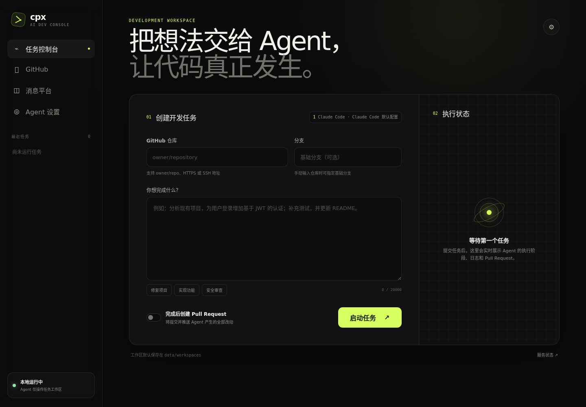
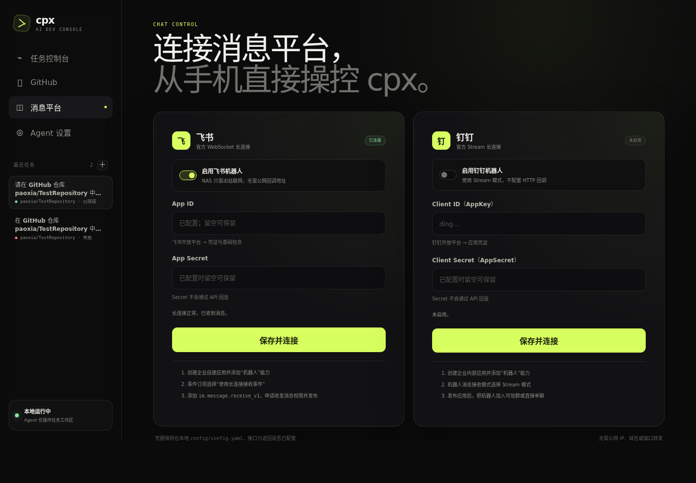
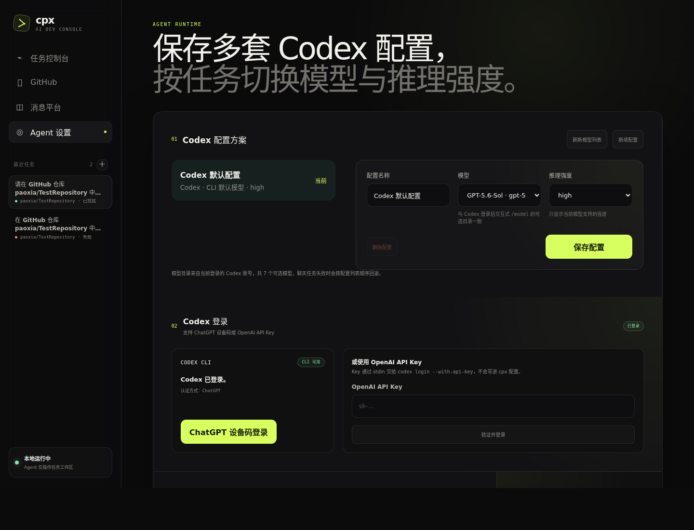

# cpx

<p align="center">
  <strong>把 NAS 变成一个可从浏览器、飞书和钉钉随时调用的 AI 开发工作站。</strong><br />
  <em>Turn your NAS into an AI development workstation controlled from the web, Feishu, or DingTalk.</em>
</p>

## 中文介绍

cpx 是一个面向个人开发者和小团队的自托管 AI 开发控制台。它把 Codex、GitHub、飞书与钉钉连接在同一个工作流中：你可以在浏览器或手机聊天里提交开发需求，cpx 会创建隔离的 Git 工作区，调用 Codex 完成修改，并按需推送分支、创建 Pull Request。

飞书和钉钉使用官方 WebSocket/Stream 长连接，NAS 只需能够出站访问网络，不需要公网 IP、HTTP 回调或固定群机器人 Webhook。Codex 可直接在页面登录；页面读取登录账号在 Codex `/model` 中看到的同一模型目录，并可把模型与其支持的推理强度保存为多套配置。项目专门提供不依赖 SSH 的极空间 Docker 部署与更新流程。

## English introduction

cpx is a self-hosted AI development console for individual developers and small teams. It brings Codex, GitHub, Feishu, and DingTalk into one workflow: submit a coding request from the browser or your phone, let cpx create an isolated Git workspace and run Codex, then optionally push a branch and open a Pull Request.

Feishu and DingTalk use their official WebSocket/Stream connections, so your NAS only needs outbound network access—no public IP, inbound HTTP callback, or fixed group webhook. Codex can be authenticated from the web console. The model selector uses the same account-specific catalog shown by Codex `/model`, and each profile only offers reasoning levels supported by its model. A no-SSH Docker workflow is included for ZSpace (极空间) NAS deployment and upgrades.

## 页面预览 / Screenshots

### 任务控制台 / Task workspace



### 飞书与钉钉长连接 / Feishu and DingTalk connections



### Codex 登录与多套模型配置 / Codex authentication and profiles



## 功能特性

- **钉钉/飞书远程控制** - 使用官方 WebSocket/Stream 长连接收发机器人消息，无需公网回调
- **Skill 插件系统** - 从 npm/local/git 安装插件，动态加载执行
- **MCP 连接器** - 支持 stdio/websocket/http 三种传输协议连接外部 MCP 服务
- **GitHub 远程操作** - 读取、修改、创建文件并自动创建 PR
- **Codex 开发控制台** - 以任务会话管理隔离工作区，可在同一任务中持续追加要求
- **账号模型目录** - 登录后读取与 Codex `/model` 相同的模型列表，并按模型联动推理强度
- **多套模型配置** - 保存配置名称、模型与推理强度，一键切换当前方案
- **权限控制** - 主分支保护、危险操作二次确认、操作审计日志
- **命令中英双语** - 支持中文和英文命令（如 `修改` / `modify`）

## 环境要求

- Node.js >= 18.0
- npm >= 8.0

## 快速开始

```bash
# 安装依赖
npm install

# 初始化配置文件
npm run dev init
# 或: npx tsx src/cli.ts init

# 编辑配置，填写钉钉/飞书应用凭据、GitHub Token 等；也可启动后在页面填写
# 编辑 config/config.yaml 和 config/permissions.yaml

# 启动系统
npm run dev start
# 或: npx tsx src/cli.ts start
```

启动后通过 HTTP 接口发送命令测试：

```bash
curl -X POST http://localhost:3000/command \
  -H "Content-Type: application/json" \
  -d '{"text":"version","userId":"u1","userName":"Tester","source":"cli"}'
```

浏览器访问 `http://localhost:3000/` 可打开 AI 开发控制台。运行控制台任务还需要：

- 本机已安装 `codex` CLI；可在页面使用 ChatGPT 设备码或 OpenAI API Key 登录。
- 本机已安装 Git，且能访问目标 GitHub 仓库。
- 通过飞书、钉钉或 API 发布 Pull Request 时还需安装 GitHub CLI（`gh`），并为 Token 配置推送分支和创建 PR 的权限；Web 任务工作台本身不提供 PR 开关。

控制台的 GitHub 页签在没有 Token 时提供“创建 GitHub Token”入口，打开 GitHub 的 fine-grained PAT 页面并预填 90 天有效期及 Contents、Pull requests、Workflows 写权限；用户仍需在 GitHub 选择资源所有者和仓库，生成后复制回控制台验证。新输入的 Token 仅在验证成功后写入 `config/config.yaml`；若 `github.token` 或 `AGENT_GITHUB_TOKEN` 已配置，可以留空直接验证，且不会将环境变量 Token 复制到配置文件。页面会区分本地文件与环境变量来源，受限 Token 只显示明确授权的仓库。

验证成功的 Token 同时供 GitHub API、HTTPS `git clone/fetch/push` 和 `gh pr create` 使用。Token 仅通过子进程环境和 askpass helper 传递，不会拼入 Git URL 或任务日志；SSH 仓库仍使用部署环境中的 SSH Key。任务控制台采用任务列表、连续对话和底部输入框布局；新建任务时可选择 Token 授权的未归档项目和基础分支，任务完成后继续输入会复用原 worktree 与 Codex 会话。还可从仓库列表点击“用于新任务”，或手动输入仓库地址和基础分支。

“Agent 设置”页管理 Codex 登录并保存多套执行方案。每套方案包含名称、模型和推理强度；模型来自当前登录账号在 Codex `/model` 中使用的同一目录，推理强度只显示该模型支持的值。设为“当前”的方案供 Web 任务使用，聊天任务在额度或鉴权失败时会按列表顺序尝试其余方案。Codex 的审批策略、沙箱模式和网页搜索写入 `CODEX_HOME/config.toml`。登录密钥不写入模型方案；页面还可用当前方案发送最多 4000 字的内容进行真实连通性测试。

### 在远程服务器连接 Codex

浏览器打开 cpx 的“Agent 设置”，在 Codex 区域点击“ChatGPT 设备码登录”，然后：

1. 在任意可信浏览器打开验证地址。
2. 登录拥有 Codex 权限的 ChatGPT 账号并输入设备码。
3. 返回页面等待状态变为“已连接”，再使用页面测试。

Codex CLI 将凭据保存在运行 cpx 的系统用户凭据目录，不写入 `console-settings.json`。也可在页面填写 OpenAI API Key；cpx 不直接持有 OAuth refresh token。参见 [Codex Authentication](https://learn.chatgpt.com/docs/auth)。

三端均可运行，但 cpx 服务必须与完成登录的 CLI 使用同一系统用户：

| 平台    | 支持方式                | 注意事项                                                                             |
| ------- | ----------------------- | ------------------------------------------------------------------------------------ |
| Linux   | 原生 Node.js / Docker   | CLI 必须在 `PATH`；服务用户的 HOME 可写。Docker 已持久化 `/root/.codex`。            |
| macOS   | 原生 Node.js            | Codex 可使用系统钥匙串或 `~/.codex`；后台服务必须以完成授权的用户运行。              |
| Windows | 原生 PowerShell，或 WSL | cpx 会通过 shell 解析 npm 的 `.cmd` 包装脚本；不要混用 Windows 与 WSL 的 HOME/凭据。 |

不要在一个系统用户下授权、再让另一个服务账户运行 cpx，否则状态检查会显示未登录。

首次使用仓库时，cpx 会把完整 Git 历史克隆到数据库所在目录下的 `repositories/<owner>/<repo>`；后续任务先 fetch 更新缓存，再通过 `git worktree` 创建 `workspaces/<task-id>`。左侧任务列表用于切换或新建任务；同一任务底部输入框可持续接收 prompt，后续轮次复用原分支、worktree 和 `thread_id`，并在会话中保留每轮用户输入与 Agent 最终回复。任务状态、轮次和日志保存在内存中，重启服务后不会恢复，但仓库缓存和工作区文件仍保留在磁盘。

> 控制台及 `/api/console/*` 当前没有身份认证，并可执行代码、读取仓库和推送分支。默认配置监听 `0.0.0.0`，请通过防火墙或带认证的反向代理限制访问，禁止直接暴露到公网。

## 极空间 Docker 部署

极空间 NAS 不需要开启 SSH。部署、更新和查看日志都通过极空间文件管理器与 Docker Compose 图形界面完成。可直接上传源代码构建，也可在开发机离线构建镜像后导入。详见 [docs/DEPLOYMENT.md](docs/DEPLOYMENT.md)。

源码部署快速步骤：

1. 在电脑获取仓库源码，把完整 `cpx` 文件夹上传到 NAS 持久化目录
2. 在极空间文件管理器中创建 `data/codex`、`data/repositories`、`data/workspaces` 和 `logs` 子目录
3. 打开“Docker → Compose → 新建项目”，项目存储位置选择上传后的 `cpx` 目录
4. 导入或粘贴根目录 `docker-compose.yml`，确认后由极空间自动构建并启动
5. 浏览器访问 `http://<NAS-IP>:3000`，在控制台连接 GitHub、Codex 和所需消息平台

更新已经运行的实例时，先在极空间 Compose 页面停止项目并备份 `data`、`config`、`logs`；在电脑取得新源码后，通过极空间文件管理器覆盖程序文件，但绝不能覆盖或删除这三个持久化目录。由于本版本把消息平台切换为纯长连接，还需要在 Compose 编辑器中同步新版 `docker-compose.yml`，再选择“重新构建并重新创建”并查看健康状态与日志。不要选择“删除数据卷”。NAS 无法稳定访问软件源或资源有限时，可在开发机构建并导出镜像，通过极空间镜像页面导入后修改镜像标签、重新创建容器。完整步骤见 [更新已运行实例](docs/DEPLOYMENT.md#十更新)。

从旧消息配置升级后，在页面重新填写钉钉 Client ID/Client Secret 或飞书 App ID/App Secret；旧的 HTTP 回调地址、签名 Secret 和固定群 Webhook 环境变量不再使用。已有 `data/codex` 会继续保留 Codex 登录。

Codex CLI 不需要在 NAS 上单独安装。`Dockerfile` 会安装 `@openai/codex`，离线镜像包也包含它。容器启动后进入“Agent 设置”完成登录、刷新账号模型目录、保存多套配置并测试。认证资料通过 `./data/codex:/root/.codex` 持久化，重新构建容器不会主动删除。

NAS 网络不能直接连接 Codex 或构建软件源时，在极空间 Compose 环境变量界面配置 `HTTP_PROXY`、`HTTPS_PROXY`、`ALL_PROXY` 和 `NO_PROXY`。代理地址必须使用容器可访问的局域网 IP，不能使用 `127.0.0.1`；基础镜像无法拉取时改用开发机构建、极空间图形界面导入镜像的方案。具体填写方式和构建/运行阶段的区别见 [部署文档的“出站代理”章节](docs/DEPLOYMENT.md#出站代理)。

镜像构建阶段可通过 `APT_MIRROR` 选择 Debian 软件源，通过 `NPM_REGISTRY` 选择 npm 源。国内开发机可分别设置为 `http://mirrors.aliyun.com` 和 `https://registry.npmmirror.com`。这两个变量只影响构建中的依赖下载，不改变运行中 Agent 的模型服务地址。

如果已有合法可用的 Clash/Mihomo 配置，也可以导入预构建镜像并使用 [docker-compose.mihomo.yml](docker-compose.mihomo.yml)，让同一 Compose 项目中的 cpx 通过 Mihomo `mixed-port` 出站。项目提供可定时更新订阅的 [Mihomo 配置示例](config/mihomo.example.yaml)。该方案不使用 TUN、特权容器或 NAS 终端；实际配置保存在 `data/mihomo` 且不会提交到 Git。首次部署见 [部署文档的“NAS 内置 Mihomo 容器”章节](docs/DEPLOYMENT.md#nas-内置-mihomo-容器)，日常试运行当前代码见 [NAS 开发调试指南](docs/NAS-DEBUGGING.md)。

## CLI 命令

```bash
agent-cli version          # 显示版本
agent-cli init [-d <dir>]  # 初始化配置文件到指定目录（默认 ./config）
agent-cli start [-d <dir>] # 启动系统
agent-cli stop             # 提示如何停止（通过 SIGTERM）
```

开发模式下使用 `npm run dev <command>`，例如 `npm run dev start`。

## 聊天命令

通过钉钉或飞书群 @机器人、机器人私聊、或 HTTP `/command` 端点发送。支持中英双语；飞书私聊也可使用 `/agent` 前缀。

### 基础命令

| 命令                        | 说明             |
| --------------------------- | ---------------- |
| `version` / `版本`          | 查看版本         |
| `help` / `帮助`             | 显示帮助         |
| `列出 skill` / `list skill` | 列出已安装 Skill |
| `列出 mcp` / `list mcp`     | 列出 MCP 连接    |

### GitHub 操作

| 命令                            | 说明                              |
| ------------------------------- | --------------------------------- |
| `查看GitHub`                    | 查看当前账号和 Token 可访问的仓库 |
| `查看分支 <owner/repo>`         | 查看仓库现有分支                  |
| `读取文件 <file>`               | 读取默认 GitHub 仓库文件内容      |
| `修改 <file> <description>`     | 执行预设的简单修改并创建 PR       |
| `新建文件 <file> <description>` | 按预设内容创建新文件并创建 PR     |

示例：`@agent 修改 README.md 添加安装说明`

### Coding Agent 开发

| 命令                                              | 说明                                  |
| ------------------------------------------------- | ------------------------------------- |
| `开发 <owner/repo>[#基础分支] [-> 新分支] <需求>` | 使用 Codex 开发并默认创建 PR          |
| `最近任务 [数量]`                                 | 查看当前用户从当前平台创建的最近任务  |
| `任务 <ID>`                                       | 查看任务状态；可使用返回 ID 的前 8 位 |
| `继续 <ID> <需求>`                                | 在原 worktree 和 Codex 会话中继续任务 |
| `取消任务 <ID>`                                   | 取消尚未结束的任务                    |

基础分支省略时使用仓库默认分支；新分支省略时自动生成 `cpx/task-*`。开发命令会先确认当前 GitHub Token 能访问仓库、基础分支存在且指定的新分支尚不存在，然后使用当前 Agent 配置；额度或鉴权失败时按配置列表回退。任务完成后可通过“继续”命令或 Web 控制台追加 prompt，已创建的 PR 会由后续提交直接更新。

飞书和钉钉使用同一原则：创建任务后，当前会话中除任务生命周期命令外的文本都交给同一个 Codex 会话处理。例如可以直接发送“把按钮改成蓝色并补充截图测试”；即使文本看起来像“查看 GitHub”、“执行 Skill”或“调用 MCP”等旧命令，也由 Codex 在任务上下文中判断和执行。`help`、`version`、新建/继续/查询/取消任务以及确认/取消操作仍由 cpx 控制。

消息平台任务会为 Codex 注入受限的 `cpx_platform` MCP 工具。Codex 可读取当前任务的平台上下文，或在需要时向创建任务的原会话发送阶段性文本；目标用户和会话由 cpx 锁定，不能由 Agent 更换。任务结束后 cpx 仍会自动回传 Agent 最终回答、状态和 PR 链接。如果当前会话还没有任务，系统会使用 `github.defaultRepo` 自动创建；没有配置默认仓库时会提示先发送“开发 owner/repo 需求”。同一任务正在执行时不会并行接受下一轮。

钉钉示例：

```text
@机器人 开发 paoxia/cpx#dev -> feature/fix-login 修复登录页面并补充测试
```

飞书示例：

```text
@机器人 开发 paoxia/cpx#dev 修复登录页面并补充测试
```

聊天任务只能由创建它的同一平台、同一用户查询、继续或取消；飞书和钉钉的自然语言续写都会优先限定在原会话。任务归属、状态和日志均保存在进程内，服务重启后不会恢复。

### Skill 执行

| 命令                  | 说明                    |
| --------------------- | ----------------------- |
| `执行 <skill> [json]` | 执行已安装的 Skill 插件 |

示例：`@agent 执行 code-review {"repo":"owner/repo"}`

### MCP 操作

| 命令                           | 说明                  |
| ------------------------------ | --------------------- |
| `连接mcp <名称>`               | 连接配置中的 MCP 服务 |
| `调用mcp <连接> <方法> [参数]` | 调用 MCP 方法         |
| `断开mcp <标识>`               | 断开 MCP 连接         |

示例：`@agent 调用mcp filesystem tools/list`

### 确认/取消

| 命令        | 说明         |
| ----------- | ------------ |
| `确认 <id>` | 确认危险操作 |
| `取消 <id>` | 取消危险操作 |

## 配置

配置文件位于 `config/` 目录，优先级从低到高：默认配置 < config.yaml < permissions.yaml < 环境变量。

### config.yaml

```yaml
server:
  port: 3000
  host: 0.0.0.0

dingtalk:
  enabled: false
  clientId: '' # Client ID / AppKey
  clientSecret: '' # Client Secret / AppSecret

feishu:
  enabled: false
  appId: ''
  appSecret: ''

github:
  token: '' # ghp_xxx Personal Access Token
  defaultRepo: '' # owner/repo 默认仓库
  defaultBranch: main

skills:
  installPath: ./data/skills
  executionTimeout: 30000 # 毫秒

mcp:
  connections: []
  # stdio 传输（本地子进程）
  # - name: filesystem
  #   transport: stdio
  #   command: npx
  #   args: ["-y", "@modelcontextprotocol/server-filesystem", "/tmp"]
  # websocket 传输
  # - name: remote-ws
  #   transport: websocket
  #   url: ws://localhost:3001
  # http 传输
  # - name: remote-http
  #   transport: http
  #   url: http://localhost:3002/mcp

logging:
  level: info # debug | info | warn | error
  file: ./logs/agent.log

storage:
  path: ./data/agent.db
```

### permissions.yaml

```yaml
git:
  protectedBranches: [main, master, production]
  allowedBranches: [feature/*, dev/*, hotfix/*]
  forbiddenOperations: [force_push, delete_branch, delete_repository]
  confirmOperations: [delete_file, merge_to_main]

operations:
  blacklist: []

confirmationTtl: 300 # 确认超时秒数
```

### 环境变量

环境变量以 `AGENT_` 前缀覆盖配置文件，适合 Docker 部署：

```bash
AGENT_SERVER_PORT=3000
AGENT_DINGTALK_ENABLED=true
AGENT_DINGTALK_CLIENT_ID=dingxxx
AGENT_DINGTALK_CLIENT_SECRET=xxx
AGENT_FEISHU_ENABLED=true
AGENT_FEISHU_APP_ID=cli_xxx
AGENT_FEISHU_APP_SECRET=xxx
AGENT_GITHUB_TOKEN=ghp_xxx
AGENT_GITHUB_DEFAULT_REPO=owner/repo
AGENT_LOGGING_LEVEL=info
AGENT_STORAGE_PATH=./data/agent.db
```

Codex 可使用 `CODEX_API_KEY`，也可直接在页面完成官方 CLI 登录；认证信息由 CLI 管理，模型方案不保存 API Key。

## HTTP API

### GET /

返回 AI 开发控制台。控制台使用以下 API：

| 端点                                         | 说明                                           |
| -------------------------------------------- | ---------------------------------------------- |
| `POST /api/console/model-test`               | 向 Codex 发送内容并返回文本回复                |
| `GET/POST /api/console/settings`             | 读取或保存多套 Codex 配置和当前配置            |
| `GET /api/console/agent-auth?provider=codex` | 检查 Codex CLI 登录状态                        |
| `POST /api/console/agent-auth/login`         | 启动 Codex 设备码登录                          |
| `POST /api/console/agent-auth/api-key`       | 通过标准输入将 API Key 交给 Codex CLI          |
| `POST /api/console/agent-auth/cancel`        | 取消进行中的 Codex 登录                        |
| `GET /api/console/codex-models`              | 读取当前账号在 Codex `/model` 使用的模型目录   |
| `GET/POST /api/console/codex-config`         | 读取或保存 `CODEX_HOME/config.toml` 的页面设置 |
| `GET/POST /api/console/integrations`         | 读取状态或保存飞书/钉钉长连接配置              |
| `GET /api/console/github`                    | 读取 Token 来源、连接状态和 PAT 创建引导       |
| `POST /api/console/github/connect`           | 验证 GitHub Token，成功后写入配置并读取仓库    |
| `GET /api/console/github/repositories`       | 使用已配置 Token 刷新全部可访问仓库            |
| `GET /api/console/github/branches`           | 读取指定 `owner/repo` 的全部分支               |
| `GET/POST /api/console/tasks`                | 列出任务或创建任务                             |
| `GET /api/console/task?id=<id>`              | 读取单个任务及日志                             |
| `POST /api/console/task/continue`            | 向已结束任务的原工作区追加 prompt              |
| `POST /api/console/cancel`                   | 取消未结束任务                                 |

仓库仅接受 `owner/repo`、GitHub HTTPS 或 GitHub SSH 地址。系统维护完整本地仓库缓存并从所选基础分支创建隔离的 `cpx/task-*` worktree；选择新建分支时使用用户提供的合法分支名。只有任务启用 `createPullRequest` 时，系统才会提交全部改动、推送任务分支并调用 `gh pr create`；后续轮次推送到同一分支和 PR。fine-grained PAT 一次只面向一个资源所有者；需要跨多个组织时，应分别部署/配置凭据或使用满足组织策略的其他 GitHub 鉴权方式。

### POST /command

测试用命令端点，无需钉钉/飞书即可调试：

```bash
curl -X POST http://localhost:3000/command \
  -H "Content-Type: application/json" \
  -d '{"text":"help","userId":"u1","userName":"Tester","source":"cli"}'
```

飞书和钉钉没有 HTTP 回调端点，也不需要固定群机器人 Webhook。应用启动后主动建立出站 WebSocket/Stream 长连接；即时回复和异步任务通知回到发起命令的会话。

## Skill 插件开发

Skill 是一个 npm 包，`package.json` 中声明 `skill` 字段：

```json
{
  "name": "my-skill",
  "version": "1.0.0",
  "main": "index.js",
  "skill": {
    "permissions": {
      "github": false,
      "mcp": false,
      "network": false,
      "filesystem": false
    }
  }
}
```

入口模块导出 `execute` 方法：

```js
module.exports = {
  async execute(ctx) {
    // ctx.args - 命令参数
    // ctx.logger - 日志器
    // ctx.github - GitHub 服务（需 permissions.github: true）
    // ctx.mcp - MCP 管理器（需 permissions.mcp: true）
    return { success: true, message: '执行完成', data: {} };
  },
};
```

`SkillInstaller` 已提供从 npm、本地目录和 Git 仓库安装的底层 API；当前 CLI 尚未暴露安装和卸载命令。

## 程序化调用

```typescript
import { AgentSystem } from 'agent-system';

const system = new AgentSystem('./config');
await system.start();

const result = await system.processCommand('version', {
  userId: 'u1',
  userName: 'Test',
  source: 'cli',
});

await system.stop();
```

## 开发

```bash
npm run build       # 编译 TypeScript
npm test            # 运行测试
npm run test:watch  # 测试监听模式
npm run coverage    # 测试覆盖率
npm run lint        # ESLint 检查
npm run format      # Prettier 格式化
```

## 项目结构

```
src/
├── cli.ts                    # CLI 入口
├── index.ts                  # 程序化 API 导出
├── core/                     # 核心模块
│   ├── AgentSystem.ts        # 系统编排根
│   ├── CommandParser.ts      # 命令解析（中英双语）
│   ├── CommandRouter.ts      # 命令路由
│   ├── EventBus.ts           # 事件总线
│   ├── HttpServer.ts         # HTTP 服务
│   └── ResponseFormatter.ts  # 响应格式化
├── config/                   # 配置管理
├── mcp/                      # MCP 连接器
│   ├── MCPManager.ts         # MCP 管理器
│   ├── JsonRpc.ts            # JSON-RPC 2.0 协议
│   └── transports/           # 传输层（stdio/websocket/http）
├── skills/                   # Skill 插件系统
├── agents/                   # Coding Agent 任务、顺序回退与 Git 工作区
├── web/                      # AI 开发控制台路由和设置
├── github/                   # GitHub 操作
├── integrations/             # 钉钉/飞书集成
├── permissions/              # 权限控制
├── storage/                  # SQLite 存储
└── utils/                    # 工具（Logger、errors 等）
public/                       # 控制台 HTML、CSS 和浏览器脚本
```

## License

MIT
